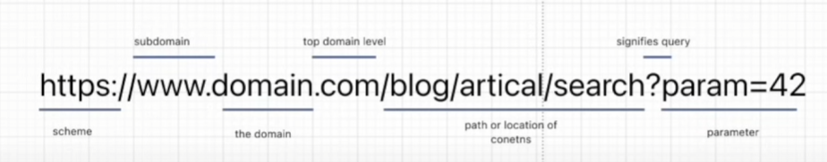

## Bug Bounty Course 2024

Quote:

You want to know the difference between a master and a beginner?
[The Master has failed more times than the beginner has ever tried]

**Video Link:**
[Bug_Bounty_Course](https://www.youtube.com/watch?v=TTw-EY7F1rM)

**Websites for Bug Bounty**

- HackerOne

**Steps to find the first bug bounty**
- Find a platform that is familiar
- Find a bug bounty program that is latest
- Find a bug bounty program with no rewards for less competition
- Follow developers and find the github's for more details

**Full Forms:**

- CVE - Common Vulnerabilities and Exposures
- CIDR notation - Classless Inter-Domain Routing notation
- CMS (Content Management System) - Software used to create, modify and update the contents of the web site which uses a database to manage all the contents. Ex: Wordpress
- DNS (Domain Name System)
- TLD (Top Level Domain) Ex: .com .org .uk .eu .in and etc
- CTF (Capture the Flag) This is a popular cybersecurity exercise or competition where participants find and exploit vulnerabilities in a system to capture a hidden piece of information or "flag".

**In-Line Commands in linux:**
- gedit (to edit files)
- gunzip (to unzip gz or other files)
- host DNS (Ex: host yahoo.com) (To find the IP address)
- ping DNS 

---

### Different type of things/actions can be done during bug bounty:

**Fuzzing**:
- Fuzzing can be used to go through a set of keywords in a particular section to find the different sub domains or other things, we can use the subdomain in an URL to find the different sub domains

---
### Tools:

**Shodan**
-  (Shodan can be used via command line in kali linux or through the GUI in browser (shadon.io))
- Shodan host (IP address) [ this command can be used to find the open ports and the transportation protocol being used and the SSl versions and other details]

**nmap**
-  Alternative of shodan
- nmap is a port scanner
- If we are working on a bug bounty program, it is feasible to provide the specific ports to knock and test rather than testing on all the open ports using nmap

**FFuF**
- This tool is helpful for fuzzing for sub domains using a wordlists
- Ex: ```ffuf -u https://FUZZ.yahoo.com/ -w /usr/share/wordlists/dirb/common.txt -p 1``` 
- ffuf can also be used to find API endpoints 
- Ex: ```ffuf -u https://api.yahoo.com/FUZZ -w /usr/share/wordlists/dirb/common.txt```
- ffuf can also be used to find directories

**durb**
- This is another alternative for FFuF, to find the subdomains
- Ex: dirb https://yahoo.com

**wpscan**
- This is another tool helps to find the details and vulnerabilities in a word press application


**Burp Suite:**
- we can see the ip address of a website in burp suite as well, in the proxy (intercept)

**Cherry Tree:**

- Taking notes is very important for the bug bounty and we can use cherry tree in kali linux to create nodes and sub nodes to sort and create notes as required

**Wappalyzer:**

- Chrome extension/ extension to other browsers to find the technologies being used by the web application or website 

**react developer tools extension** 
-  This extension can be used to identify the react built websites as the extension will light up upon visiting a react based website

**w3techs.com** 
- Similar to wappalyzer to provide all the technologies being used by the site and other details

**dotdotpwn** 
- A tool for the path traversal 
Installation: sudo apt-get install dotdotpwn

***Recon_testing_applications/commands***

**wfuzz**
- This can be used for fuzzing

**dig**
- This can be used for finding the sub domains

**nslookup**
- This can be used to find the port number and ip address from the dns

**whois**
- This i can be used in the recon phase as well, this provides more information about the domain name, where it is registered and other details

**theHarvester**

- This software as well helps with finding the sub domains and other details 

**crt.sh**

- This website can also be used to find the sub domains for recon testing

**wayback**

- To find the older url's and sub domains of the provided url/domain

**httprobe**

- To find the valid URL's in the list of sub domains and domain URLs

***sublist3r***

- Tool to find the sub domains of a URL from different search engines

- **Open list** extension for the browser to open multiple URL's at once to test the sub domains extracted

***amass***
- Another tool to grab all the sub domains of the URL (better version of sublist3r)
- Ex: amass enum -passive -d yahoo.com


---

### Notes:

**Bug_Bounty_Checklist:**

- Bug Bounty checklist is very important before starting a bug bounty program, to track the actions performed and pending tasks to recon and other things

**Recon Phase:**



<!--Completed till 1:23:29 -->

**Tools required to start with the bug bounty:**

- Kali linux VM
- gedit (for text editing)
- sublist3r (sudo apt install sublist3r)
sublist3r -d www.yahoo.com
- FFuF
- dirb 
- vpn (in case if ip gets banned)

**CyberChef**:

- We can use cyber chef and inside that magic tab to debug any cookies


**XXE (XML External Entities)**
- we can use XML to perform system actions by system like retrieving a etc/passwd file

- code:
```
<?xml version="1.0" encoding="ISO-8859-1"?>
<!DOCTYPE foo [
  <!ENTITY xxe SYSTEM "file:///etc/passwd" >]>
<foo>&xxe;</foo> 
```

**SQL Injection**
- Basic Commands:
1) ```'+OR+1=1--``` To ignore the where condition and output everything as the 1=1 is true
2) ```'+UNION+SELECT+'abc','def'+FROM+dual--``` To determine the number of column it outputs as union needs to have the same number of column outputs as the initial select statement
3) ```'+UNION+SELECT+BANNER,+NULL+FROM+v$version--``` To retrieve the oracle database, database version
4) ```'+UNION+SELECT+@@version,+NULL#``` To retrieve the mysql and microsoft database version


